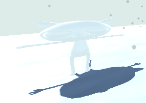

Va vers le modèle que tu veux utiliser dans la fenêtre Project et fais glisser le modèle dans ta vue Scene.

Si ton modèle a des GameObjects enfants associés, tu peux les activer et les désactiver en utilisant la case à cocher située à côté de leur nom dans la fenêtre Inspector.

Tu peux personnaliser ton personnage en faisant glisser des « Matériaux » sur les GameObjects dans la vue Scene. Cet exemple utilise le modèle Cat avec un matériau blanc « Snow » au lieu de son matériau habituel :

