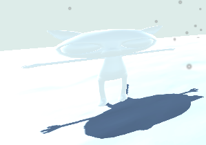

Navigeer in het projectvenster naar het model dat je wilt gebruiken en sleep het model naar je scèneweergave.

Als je model onderliggende GameObjects gekoppeld heeft, kun je deze inschakelen en uitschakelen met behulp van het selectievakje naast hun naam in het Inspector-venster.

Je kunt je personage aanpassen door 'Materialen' naar de GameObjects in de scèneweergave te slepen. In dit voorbeeld wordt het Cat-model gebruikt met wit 'Snow'-materiaal in plaats van het gebruikelijke materiaal:

